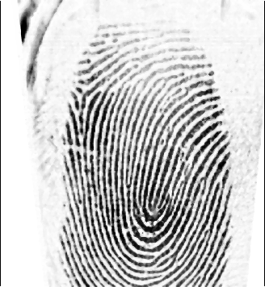
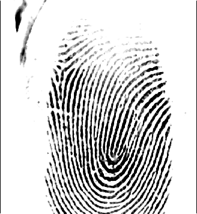
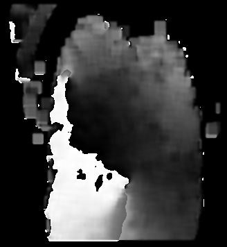
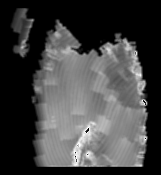
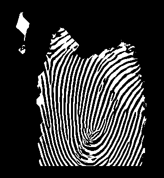
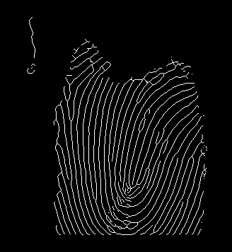
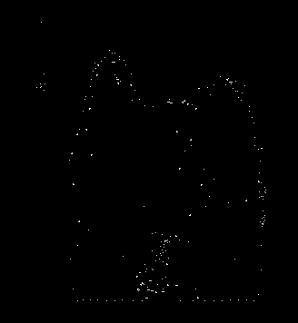
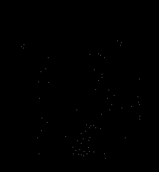

# MFC-FingerPrint
基于MFC开发的指纹识别系统.

---------
##### 效果图如下:


在第12步特征入库中，会对当前指纹的mdl数据与databases中所有的mdl进行对比,然后返回识别结果.


## 一.载入图像

在点击之后,选择需要识别的图片. 图片路径为beginfilename.
```c++
void CFingerDlg::OnBnClickedOk1()
{
	CFileDialog    dlgFile(TRUE, NULL, NULL, OFN_HIDEREADONLY, _T("Describe Files (*.bmp)|*.bmp|All Files (*.*)|*.*||"), NULL);

	if (dlgFile.DoModal())
	{
		strFile = dlgFile.GetPathName();
	}
	char *info = "";

	USES_CONVERSION;
	char * beginfilename = T2A(strFile);
	Step1_LoadBmpImage(beginfilename,info);

	ShowImageInCtrl(m_picCtrl1, beginfilename);

	// TODO: 在此添加控件通知处理程序代码
}
```
Step1_LoadBmpImage中就是获取初始图片的RGB信息.
```c++
int Step1_LoadBmpImage(char *beginfilename,char* info) {
	char *filename = beginfilename;
	CopyFile(ToWideChar(filename), ToWideChar(STEP_TXT_1), false);

	int iWidth, iHeight, iDepth;
	int flag = ReadBMPImgFilePara(filename, iWidth, iHeight, iDepth);
	if (flag != 0) {
		//sprintf(info,"图像加载失败");
		::MessageBox(NULL, _T("图像加载失败"), _T("error"), MB_OK);
		return -1;
	}
	unsigned char *data = new unsigned char[iWidth*iHeight];
	flag = ReadBMPImgFileData(filename, data);
	if (flag != 0) {
		//sprintf(info, "图像数据读取失败");
		::MessageBox(NULL, _T("图像数据读取失败"), _T("error"), MB_OK);
		delete[] data;
		return -2;
	}
	flag = SaveDataToTextFile(STEP_TXT_1, data, iWidth, iHeight);
	if (flag != 0) {
		//sprintf(info,"数据保存失败");
		::MessageBox(NULL, _T("数据保存失败"), _T("error"), MB_OK);
		delete[] data;
		return -3;
	}
	//sprintf(info, "源图[%s],宽度[%d]，高度[%d]，深度[%d b]",filename,iWidth,iHeight,iDepth);
	delete[] data;
	return 0;
}
```

其中具体的Txt与BMP转换参考具体源代码.

---------

## 二.中值滤波
中值滤波实现算法,ucImg由第一步得来.
```c++
int MidFilter(unsigned char *ucImg, unsigned char *ucDstImg, int iWidth, int iHeight) {
	memset(ucDstImg, 0, iWidth*iHeight);
	unsigned char *pUp, *pDown, *pImg;
	unsigned char x[9];
	for (int i = 1; i < iHeight - 1; i++) {
		pUp = ucImg + (i - 1)*iWidth;
		pImg = ucImg + i * iWidth;
		pDown = ucImg + (i + 1)*iWidth;
		int j;
		for (j = 1; j < iWidth - 1; j++) {
			pUp++;
			pImg++;
			pDown++;
			x[0] = *(pUp - 1);
			x[1] = *(pImg - 1);
			x[2] = *(pDown - 1);
			x[3] = *pUp;
			x[4] = *pImg;
			x[5] = *pDown;
			x[6] = *(pUp + 1);
			x[7] = *(pImg + 1);
			x[8] = *(pDown + 1);

			Sort(x, 9);
			*(ucDstImg + i * iWidth + j) = x[4];
		}
	}
	int j;
	pDown = ucImg + iWidth;
	for (j = 1; j < iWidth - 1; j++) {
		x[0] = *(ucImg + j - 1);
		x[1] = *(ucImg + j);
		x[2] = *(ucImg + j + 1);
		x[3] = *(pDown + j - 1);
		x[4] = *(pDown + j);
		x[5] = *(pDown + j + 1);
		Sort(x, 6);
		*(ucDstImg + j) = x[3];
	}
	pUp = ucImg + iWidth * (iHeight - 2);
	pDown = ucImg + iWidth * (iHeight - 1);
	for (j = 1; j < iWidth - 1; j++) {
		x[0] = *(pDown + j - 1);
		x[1] = *(pDown + j);
		x[2] = *(pDown + j + 1);
		x[3] = *(pUp + j - 1);
		x[4] = *(pUp + j);
		x[5] = *(pUp + j + 1);
		Sort(x, 6);
		*(ucDstImg + iWidth * (iHeight - 1) + j) = x[3];
	}
	x[0] = *(ucImg);
	x[1] = *(ucImg + 1);
	x[2] = *(ucImg + iWidth);
	x[3] = *(ucImg + iWidth + 1);
	Sort(x, 4);
	*(ucDstImg) = x[2];

	x[0] = *(ucImg + iWidth - 1);
	x[1] = *(ucImg + iWidth - 2);
	x[2] = *(ucImg + 2 * iWidth - 1);
	x[3] = *(ucImg + 2 * iWidth - 2);

	Sort(x, 4);
	*(ucDstImg + iWidth - 1) = x[2];

	x[0] = *(ucImg + iWidth * (iHeight - 1));
	x[1] = *(ucImg + iWidth * (iHeight - 2));
	x[2] = *(ucImg + iWidth * (iHeight - 1) + 1);
	x[3] = *(ucImg + iWidth * (iHeight - 2) + 1);
	Sort(x, 4);
	*(ucDstImg + (iHeight - 1)*iWidth) = x[2];
	x[0] = *(ucImg + iWidth * (iHeight - 0) - 1);
	x[1] = *(ucImg + iWidth * (iHeight - 1) - 1);
	x[2] = *(ucImg + iWidth * (iHeight - 0) - 2);
	x[3] = *(ucImg + iWidth * (iHeight - 1) - 2);
	Sort(x, 4);

	*(ucDstImg + (iHeight - 0)*iWidth - 1) = x[2];

	return 0;
}
```


 --------
## 三.均值化
```c++
int HistoNormalize(unsigned char* ucImg,unsigned char* ucNormImg, int iWidth,int iHeight) {
	unsigned int Histogram[256];

	memset(Histogram, 0, 256 * sizeof(int));
	for (int i = 0; i < iHeight; i++) {
		for (int j = 0; j < iWidth; j++) {
			Histogram[ucImg[i*iWidth + j]]++;
		}
	}
	double dMean = 0;
	for (int i = 1; i < 255; i++) {
		dMean += i * Histogram[i];
	}
	dMean = int(dMean/(iWidth*iHeight));
	double dSigma = 0;
	for (int i = 0; i < 255; i++) {
		dSigma += Histogram[i] * (i - dMean)*(i-dMean);
	}
	dSigma /= (iWidth*iHeight);
	dSigma = sqrt(dSigma);

	double dMean0 = 128, dSigma0 = 128;
	double dCoeff = dSigma0 / dSigma;
	for (int i = 0; i < iHeight; i++) {
		for(int j=0;j<iWidth;j++){
			double dVal = ucImg[i*iWidth + j];
			dVal = dMean0 + dCoeff * (dVal-dMean0);
			if (dVal < 0) {
				dVal = 0;
			}
			else if (dVal > 255) {
				dVal = 255;
			}
			ucNormImg[i*iWidth + j] = (unsigned char)dVal;
		}
	}
	return 0;
}
```


--------
## 四.方向计算
```c++
int ImgDirection(unsigned char* ucImg,float* fDirc,int iWidth,int iHeight) {
	const int SEMISIZ = 7;
	int dx[SEMISIZ * 2 + 1][SEMISIZ * 2 + 1];
	int dy[SEMISIZ * 2 + 1][SEMISIZ * 2 + 1];
	float fx, fy;
	memset(fDirc, 0, iWidth*iHeight * sizeof(float));
	for (int y = SEMISIZ + 1; y < iHeight - SEMISIZ - 1; y++) {
		for (int x = SEMISIZ + 1; x < iWidth - SEMISIZ - 1; x++) {
			for (int j = 0; j < SEMISIZ * 2 + 1; j++) {
				for (int i = 0; i < SEMISIZ * 2 + 1; i++) {
					int index1 = (y + j - SEMISIZ)*iWidth + x + i - SEMISIZ;
					int index2 = (y + j - SEMISIZ)*iWidth + x + i - SEMISIZ - 1;
					int index3 = (y + j - SEMISIZ - 1)*iWidth + x + i - SEMISIZ;
					dx[i][j] = int(ucImg[index1] - ucImg[index2]);
					dy[i][j] = int(ucImg[index1] - ucImg[index3]);
				}
			}
			fx = 0.0;
			fy = 0.0;
			for (int j = 0; j < SEMISIZ * 2 + 1; j++) {
				for (int i = 0; i < SEMISIZ * 2 + 1; i++) {
					fx += 2 * dx[i][j] * dy[i][j];
					fy += (dx[i][j] * dx[i][j] - dy[i][j] * dy[i][j]);
				}
			}
			fDirc[y*iWidth + x] = atan2(fx,fy);
		}
	}
	return 0;
}
```


--------
## 五.频率计算
```c++
int DircLowPass(float *fDirc,float* fFitDirc,int iWidth,int iHeight) {
	const int DIR_FILTER_SIZE = 2;
	int blocksize = 2 * DIR_FILTER_SIZE + 1;
	int imgsize = iWidth * iHeight;
	float *filter = new float[blocksize*blocksize];
	float *phix = new float[imgsize];
	float *phiy = new float[imgsize];
	float *phi2x = new float[imgsize];
	float *phi2y = new float[imgsize];
	memset(fFitDirc,0,sizeof(float)*iWidth*iHeight);
	float tempSum = 0.0;
	for (int y = 0; y < blocksize; y++) {
		for (int x = 0; x < blocksize; x++) {
			filter[y*blocksize + x] = (float)(blocksize - (abs(DIR_FILTER_SIZE - x) + abs(DIR_FILTER_SIZE - y)));
			tempSum += filter[y*blocksize + x];
		}
	}
	for (int y = 0; y < blocksize; y++) {
		for (int x = 0; x < blocksize; x++) {
			filter[y*blocksize + x] /= tempSum;
		}
	}
	for(int y=0;y<iHeight;y++){
		for (int x = 0; x < iWidth; x++) {
			phix[y*iWidth + x] = cos(fDirc[y*iWidth + x]);
			phiy[y*iWidth + x] = sin(fDirc[y*iWidth + x]);
		}
	}
	memset(phi2x, 0, sizeof(float)*imgsize);
	memset(phi2y, 0, sizeof(float)*imgsize);
	float nx, ny;
	int val;
	for (int y = 0; y < iHeight - blocksize; y++) {
		for (int x = 0; x < iWidth - blocksize; x++) {
			nx = 0.0;
			ny = 0.0;
			for (int j = 0; j < blocksize; j++) {
				for (int i = 0; i < blocksize; i++) {
					val = (x + i) + (j + y)*iWidth;
					nx += filter[j*blocksize + i] * phix[val];
					ny += filter[j*blocksize + i] * phiy[val];
				}
			}
			val = x + y * iWidth;
			phi2x[val] = nx;
			phi2y[val] = ny;
		}
	}

	for (int y = 0; y < iHeight - blocksize; y++) {
		for (int x = 0; x < iWidth - blocksize; x++) {
			val = x + y * iWidth;
			fFitDirc[val] = atan2(phi2y[val],phi2x[val])*0.5;
		}
	}
	delete[] phi2y;
	delete[] phi2x;
	delete[] phiy;
	delete[] phix;

	return 0;
}
```


--------

## 六.掩码计算
```c++
int GetMask(unsigned char* ucImg,float *fDirection,float *fFrequency,unsigned char *ucMask,int iWidth,int iHeight) {
	float freqMin = 1.0 / 25.0;
	float freqMax = 1.0 / 3.0;
	int x, y, k;
	int pos, posout;
	memset(ucMask,0,iWidth*iHeight);
	for (y = 0; y < iHeight; y++) {
		for (x = 0; x < iWidth; x++) {
			pos = x + y * iWidth;
			posout = x + y * iWidth;
			ucMask[posout] = 0;
			if (fFrequency[pos] >= freqMin && fFrequency[pos] <= freqMax) {
				ucMask[posout] = 255;
			}
		}
	}
	for (k = 0; k < 4; k++) {
		for (y = 1; y < iHeight - 1; y++) {
			for (x = 1; x < iWidth - 1; x++) {
				if (ucMask[x + y * iWidth] == 0xFF) {
					ucMask[x - 1 + y * iWidth] |= 0x80;
					ucMask[x + 1 + y * iWidth] |= 0x80;
					ucMask[x + (y-1) * iWidth] |= 0x80;
					ucMask[x + (y+1) * iWidth] |= 0x80;
				}
			}
		}
		for (y = 1; y < iHeight - 1; y++) {
			for (x = 1; x < iWidth - 1; x++) {
				if (ucMask[x + y * iWidth]) {
					ucMask[x + y * iWidth] = 0xFF;
				}
			}
		}
	}
	for (k = 0; k < 12; k++) {
		for (y = 1; y < iHeight - 1; y++) {
			for (x = 1; x < iWidth - 1; x++) {
				if (ucMask[x + y * iWidth] == 0x0) {
					ucMask[x - 1 + y * iWidth] &= 0x80;
					ucMask[x + 1 + y * iWidth] &= 0x80;
					ucMask[x + (y - 1) * iWidth] &= 0x80;
					ucMask[x + (y + 1) * iWidth] &= 0x80;
				}
			}
		}
		for (y = 1; y < iHeight - 1; y++) {
			for (x = 1; x < iWidth - 1; x++) {
				if (ucMask[x + y * iWidth] != 0xFF) {
					ucMask[x + y * iWidth] = 0x0;
				}
			}
		}
	}
	return 0;
}
```


--------
## 七.Gabor增强
```c++
int GaborEnhance(unsigned char* ucImg, float* fDirection, float* fFrequency, unsigned char* ucMask, unsigned char* ucImgEnhanced, int iWidth, int iHeight) {
	const float PI = 3.141592654;
	int i, j, u, v;
	int wg2 = 5;
	float sum, f, g;
	float x2, y2;
	float dx2 = 1.0 / (4.0*4.0);
	float dy2 = 1.0 / (4.0*4.0);
	memset(ucImgEnhanced,0,iWidth*iHeight);
	for (j = wg2; j < iHeight - wg2; j++) {
		for (i = wg2; i < iWidth - wg2; i++) {
			if (ucMask[i + j * iWidth] == 0) {
				continue;
			}
			g = fDirection[i+j*iWidth];
			f = fFrequency[i+j*iWidth];
			g += PI / 2;
			sum = 0.0;
			for (v = -wg2; v <= wg2; v++) {
				for (u = -wg2; u <= wg2; u++) {
					x2 = -u * sin(g) + v * cos(g);
					y2 = u * cos(g) + v * sin(g);
					sum += exp(-0.5*(x2*x2*dx2 + y2 * y2*dy2))*cos(2 * PI*x2*f)*ucImg[(i - u) + (j - v)*iWidth];
				}
			}
			if (sum > 255.0) {
				sum = 255.0;
			}
			if (sum < 0.0) {
				sum = 0.0;
			}
			ucImgEnhanced[i + j * iWidth] = (unsigned char)sum;
		}
	}
	return 0;
}
```


--------
## 八.二值化
```c++

int BinaryImg(unsigned char* ucImage,unsigned char* ucBinImage,int iWidth,int iHeight,unsigned char uThreshold) {
	unsigned char *pStart = ucImage, *pEnd = ucImage + iWidth * iHeight;
	unsigned char *pDest = ucBinImage;
	while (pStart < pEnd) {
		*pDest = *pStart > uThreshold ? 1 : 0;
		pStart++;
		pDest++;
	}
	return 0;
}

int BinaryToGray(unsigned char *ucBinImg,unsigned char *ucGrayImg,int iWidth,int iHeight) {
	unsigned char *pStart = ucBinImg, *pEnd = ucBinImg + iWidth * iHeight;
	unsigned char *pDest = ucGrayImg;

	while (pStart<pEnd) {
		*pDest = (*pStart) > 0 ? 255 : 0;
		pStart++;
		pDest++;
	}
	return 0;
}
```


--------
## 九.细化
```c++
int Thinning(unsigned char *ucBinedImg,unsigned char *ucThinnedImage,int iWidth,int iHeight,int iIterativeLimit) {
	unsigned char x1, x2, x3, x4, x5, x6, x7, x8, xp;
	unsigned char g1, g2, g3, g4;
	unsigned char b1, b2, b3, b4;
	unsigned char np1, np2, npm;
	unsigned char *pUp, *pDown, *pImg;
	int iDeletePoints = 0;

	memcpy(ucThinnedImage,ucBinedImg,iWidth*iHeight);
	for (int it = 0; it < iIterativeLimit; it++) {
		iDeletePoints = 0;
		for (int i = 1; i < iHeight - 1; i++) {
			pUp = ucBinedImg + (i - 1)*iWidth;
			pImg = ucBinedImg + i * iWidth;
			pDown = ucBinedImg + (i + 1)*iWidth;
			for (int j = 1; j < iWidth - 1; j++) {
				pUp++;
				pImg++;
				pDown++;
				if (!*pImg) {
					continue;
				}
				x6 = *(pUp - 1);
				x5 = *(pImg - 1);
				x4 = *(pDown - 1);
				x7 = *pUp;
				xp = *pImg;
				x3 = *pDown;
				x8 = *(pUp + 1);
				x1 = *(pImg+1);
				x2 = *(pDown+1);


				b1 = !x1 && (x2 == 1 || x3 == 1);
				b2 = !x3 && (x4 == 1 || x5 == 1);
				b3 = !x5 && (x6 == 1 || x7 == 1);
				b4 = !x7 && (x8 == 1 || x1 == 1);

				g1 = (b1 + b2 + b3 + b4) == 1;

				np1 = x1 || x2;
				np1 += x3 || x4;
				np1 += x5 || x6;
				np1 += x7 || x8;
				np2  = x2 || x3;
				np2 += x4 || x5;
				np2 += x6 || x7;
				np2 += x8 || x1;

				npm = np1 > np2 ? np2 : np1;
				g2 = npm >= 2 && npm <= 3;
				g3 = (x1 && (x2 || x3 || !x8)) == 0;
				g4 = (x5 && (x6 || x7 || !x4)) == 0;

				if (g1&&g2&&g3) {
					ucThinnedImage[iWidth*i + j] = 0;
					++iDeletePoints;
				}
			}
		}
		memcpy(ucBinedImg,ucThinnedImage,iWidth*iHeight);
		for (int i = 1; i < iHeight - 1;i++) {
			pUp = ucBinedImg + (i - 1)*iWidth;
			pImg = ucBinedImg + i * iWidth;
			pDown = ucBinedImg + (i+1) * iWidth;
			for (int j = 1; j < iWidth - 1; j++) {
				pUp++;
				pImg++;
				pDown++;
				if (!*pImg) {
					continue;
				}
				x6 = *(pUp - 1);
				x5 = *(pImg - 1);
				x4 = *(pDown - 1);

				x7 = *pUp;
				xp = *pImg;
				x3 = *pDown;

				x8 = *(pUp + 1);
				x1 = *(pImg + 1);
				x2 = *(pDown + 1);

				b1 = !x1 && (x2 == 1 || x3 == 1);
				b2 = !x3 && (x4 == 1 || x5 == 1);
				b3 = !x5 && (x6 == 1 || x7 == 1);
				b4 = !x7 && (x8 == 1 || x1 == 1);

				g1 = (b1 + b2 + b3 + b4) == 1;

				np1 = x1 || x2;
				np1 += x3 || x4;
				np1 += x5 || x6;
				np1 += x7 || x8;

				np2 = x2 || x3;
				np2 += x4 || x5;
				np2 += x6 || x7;
				np2 += x8 || x1;

				npm = np1 > np2 ? np2 : np1;
				g2 = npm >= 2 && npm <= 3;

				g3 = (x1 && (x2 || x3 || !x8)) == 0;
				g4 = (x5 && (x6 || x7 || !x4)) == 0;

				if (g1&&g2&&g4) {
					ucThinnedImage[iWidth*i+j] = 0;
					++iDeletePoints;
				}
 			}
		}

		memcpy(ucBinedImg,ucThinnedImage,iWidth*iHeight);

		if (iDeletePoints == 0) {
			break;
		}
	}

	for (int i = 0; i < iHeight; i++) {
		for (int j = 0; j < iWidth; j++) {
			if (i < 16) {
				ucThinnedImage[i*iWidth + j] = 0;
			}
			else if (i >= iHeight - 16) {
				ucThinnedImage[i*iWidth + j] = 0;
			}
			else if (j < 16) {
				ucThinnedImage[i*iWidth + j] = 0;
			}
			else if (j >= iWidth - 16) {
				ucThinnedImage[i*iWidth + j] = 0;
			}
		}
	}
	return 0;
}
```


--------
## 十.特征提取
```c++
int CutEdge(MINUTIAE* minutiaes,int count,unsigned char*ucImg,int iWidth,int iHeight) {
	int minuCount = count;
	int x, y, type;
	bool del;
	int *pFlag = new int[minuCount];
	memset(pFlag,0,sizeof(int)*minuCount);
	for (int i = 0; i < minuCount; i++) {
		y = minutiaes[i].y - 1;
		x = minutiaes[i].x - 1;
		type = minutiaes[i].type ;
		del = true;
		if (x < iWidth / 2) {
			if (abs(iWidth / 2 - x) > abs(iHeight / 2 - y)) {
				while (--x >= 0) {
					if (ucImg[x + y * iWidth] > 0) {
						del = false;
						break;
					}
				}
			}
			else {
				if (y > iHeight / 2) {
					while (++y < iHeight) {
						if (ucImg[x + y * iWidth] > 0) {
							del = false;
							break;
						}
					}
				}
				else {
					while (--y == 0) {
						if (ucImg[x + y * iWidth] > 0) {
							del = false;
							break;
						}
					}
				}
			}
		}
		else {
			if (abs(iWidth / 2 - x) > abs(iHeight / 2 - y)) {
				while (++x < iWidth) {
					if (ucImg[x + y * iWidth] > 0) {
						del = false;
						break;
					}
				}
			}
			else {
				if (y > iHeight / 2) {
					while (++y < iHeight) {
						if (ucImg[x + y * iWidth] > 0) {
							del = false;
							break;
						}
					}
				}
				else {
					while (--y >= 0) {
						if (ucImg[x + y * iWidth] > 0) {
							del = false;
							break;
						}
					}
				}
			}
		}
		if (del) {
			pFlag[i] = 1;
			continue;
		}
	}
	int newCount = 0;
	for (int i = 0; i < minuCount; i++) {
		if (pFlag[i] == 0) {
			memcpy(&minutiaes[newCount],&minutiaes[i],sizeof(MINUTIAE));
			newCount++;
		}
	}
	delete[] pFlag;
	pFlag = NULL;
	return newCount;
}
```


--------
## 十一.特征过滤
```c++
int MinuFilter(unsigned char *minuData,unsigned char *thinData,MINUTIAE *minutiaes,int &minuCount,int iWidth,int iHeight) {
	float *dir = new float[iWidth*iHeight];
	memset(dir,0,iWidth*iHeight*sizeof(float));
	ImgDirection(thinData,dir,iWidth,iHeight);
	unsigned char* pImg;
	unsigned char val;
	int temp = 0;
	for (int i = 1; i < iHeight - 1; i++) {
		pImg = minuData + i * iWidth;
		for (int j = 1; j < iWidth - 1; j++) {
			++pImg;
			val = *pImg;
			if(val>0){
				minutiaes[temp].x = j + 1;
				minutiaes[temp].y = i + 1;
				minutiaes[temp].theta = dir[i*iWidth+j];
				minutiaes[temp].type = int(val);
				++temp;
			}
		}
	}
	delete[] dir;
	minuCount = CutEdge(minutiaes,minuCount,thinData,iWidth,iHeight);
	int *pFlag = new int[minuCount];
	memset(pFlag,0,sizeof(int)*minuCount);
	int x1, x2, y1, y2, type1, type2;
	for (int i = 0; i < minuCount; i++) {
		x1 = minutiaes[i].x;
		y1 = minutiaes[i].y;
		type1 = minutiaes[i].type;
		for (int j = i + 1; j < minuCount; j++) {
			if (pFlag[i] == 1) {
				continue;
			}
			x2 = minutiaes[j].x;
			y2 = minutiaes[j].y;
			type2 = minutiaes[j].type;

			int r = (int)sqrt(float((y1-y2)*(y1-y2)+(x1-x2)*(x1-x2)));

			if (r <= 4) {
				if (type1 == type2) {
					if (type1 == 1) {
						pFlag[i] = pFlag[j] = 1;
					}
					else {
						pFlag[j] = 1;
					}
				}
				else if (type1 == 1) {
					pFlag[i] = 1;
				}
				else {
					pFlag[j] = 1;
				}
			}
		}

	}
	int newCount = 0;
	for (int i = 0; i < minuCount; i++) {
		if (pFlag[i] == 0) {
			memcpy(&minutiaes[newCount],&minutiaes[i],sizeof(MINUTIAE));
			newCount++;
		}
	}
	delete[] pFlag;
	minuCount = newCount;
	return 0;
}
```

